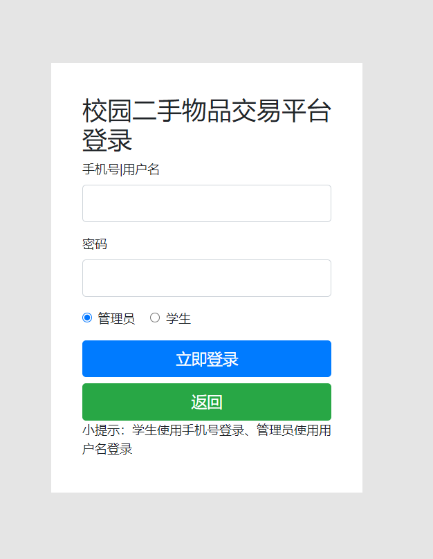

## 基于SSM框架的校园二手物品交易平台系统

###  获取sql数据库文件: 从戎源码网 (https://armycodes.com/) QQ: 386869957 QQ群: 377586148
###  所有系统地址: (https://github.com/YuLin-Coder/AllProjectCatalog) 
###  所有项目以及源代码本人均调试运行无问题 可支持远程安装部署调试、定制修改、代码讲解

## 项目介绍
基于SSM框架的校园二手物品交易平台系统，有学生和管理员两个角色。
本平台主要是对学生发布的二手物品进行管理可以发布进行出售、注册的学生可以进行在线购买校园里二手物品、同时发布一些失物信息等、对下订单的二手物品进行评论、查看公告、查看失物等功能。

主要功能
网站主要有首页、失物大厅、物品大厅、物品详情页、失物详情页、通知公告、购物车​等模块。
学生端主要有注册、登录、发布二手物品、发布丢失物品、购买二手物品、查看我的订单、进行评论二手物品、个人信息查看、修改等功能。
管理员端主要有登录、公告管理、类别管理、物品管理、失物管理、数据统计、学生管理、评论管理、订单管理等功能模块。

## 项目技术
- 编程语言：Java
- 数据库：MySQL
- 前端技术：JSP、Bootstrap、HTML、CSS、JS、JQuery
- 后端技术：Spring、SpringMVC、MyBatis

## 运行环境
- JDK版本：JDK1.8及以上
- 开发工具：IDEA、Ecplise、Myecplise都可以
- 数据库: MySQL5.7及以上

## 运行截图

